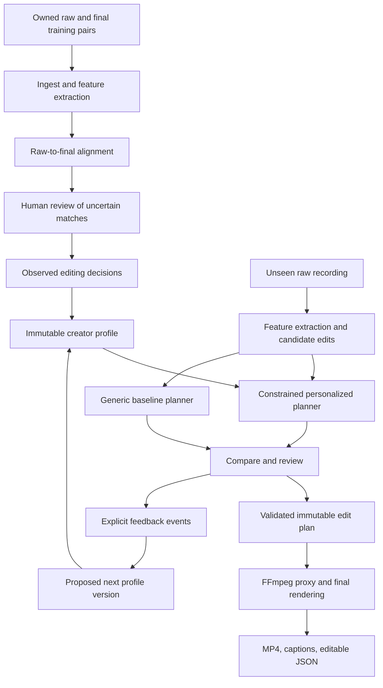

# EditDNA technical architecture

Status: proposed, unimplemented. Date: 2026-09-08.
Upstream: [scope](scope.md), [requirements](prd.md). All performance limits and evaluation gates below are design targets pending measurement.

## 1. Overview and architectural decisions

EditDNA is a media processing application with a learned preference layer. Its central pipeline is:

Raw/final pairs -> normalized evidence -> source alignment -> observed edit decisions -> versioned creator profile -> constrained first-cut planner -> review -> deterministic render.

Use a modular monolith plus a separate media worker, rather than a collection of agents or microservices. The browser handles interaction; Python handles media analysis, profile estimation, and planning; FFmpeg executes the validated timeline. No LLM directly writes shell commands, file paths, or executable render graphs.

The initial learning method is regularized statistical preference estimation with example retrieval. It does not fine-tune a large model. Later preference ranking is an explicit upgrade gated by held-out results.

## 2. Stack and deployment

| Layer | First implementation | Purpose |
|---|---|---|
| UI | React, TypeScript, Vite | Pair review, profile evidence, transcript and segment editing |
| API | FastAPI, Pydantic, SQLAlchemy | Typed requests, validation, project state |
| Metadata | SQLite with WAL, migrations | Durable jobs, profiles, plans, feedback |
| Files | Content-addressed local workspace storage | Originals, proxies, features, previews, exports |
| Worker | Separate Python process, SQLite-backed leased job queue | Recoverable media jobs without blocking API requests |
| Media | FFmpeg/ffprobe, NumPy/SciPy | Normalization, audio features, alignment refinement, rendering |
| Transcription | faster-whisper, configurable model and device | Local word-timestamped speech recognition |
| Optional semantic features | Provider interface; Gemini structured output candidate | Sentence role and equivalence proposals, not edit authority |
| Later interchange | OpenTimelineIO | Export a named tested subset of timeline operations |

Pin package versions and model artifacts during implementation after compatibility checks. Python 3.11 and Node 24 are proposed runtimes, not verified machine capabilities. GPU acceleration is optional; benchmark CPU transcription first. FFmpeg is explicitly required for our processing pipeline regardless of how the transcription library decodes audio.

### Local mode

FastAPI serves the compiled UI and same-origin API. A worker processes a bounded queue. Bind to loopback; use a per-install session secret and origin checks for writes. Media stays on disk. A browser refresh does not destroy projects. Never expose a privileged local service through an unauthenticated tunnel.

### Hosted judge mode

Deploy the API and worker as container processes on a host with persistent storage and sufficient CPU. Serve the frontend from the same origin. Use isolated sessions, upload quotas, and authenticated artifact access. Provide small owned example pairs and clearly labelled cached analyses plus an actual rerun path. The first judge experience needs no cloud model key or channel login.

### Production expansion

Replace SQLite with PostgreSQL, local files with S3-compatible object storage, and job claims with a managed queue. Preserve stage contracts. Separate CPU proxy/render workers and GPU analysis workers only when load justifies it. Jobs reference artifact IDs rather than local paths so storage can be replaced. This is a migration plan, not infrastructure to build initially.

## 3. Data flow and components



### 3.1 Ingest and normalization — E1, E7

Stream upload to temporary storage with byte limits, verify container with ffprobe, calculate SHA-256, and atomically register the immutable original. Deduplication is within one owner/workspace; do not reveal cross-user file existence.

Generate a low-resolution preview proxy, mono analysis audio, waveform peaks, thumbnails, and a presentation-timestamp index. Preserve original PTS and rational time bases. ASR positions refer to normalized audio; keep the transform back to original media. Variable-frame-rate video must not be addressed as frame number divided by nominal FPS.

Hash original bytes, model version, extraction configuration, and algorithm version into each analysis cache key. Keep originals and normalized derivatives distinct. Corrupt media or files with missing required audio fail with a clear error before learning begins.

### 3.2 Feature extraction — E1, E3

Produce word spans, utterance boundaries, speech confidence, silence intervals, normalized audio fingerprints, sentence text, and candidate repeated-take groups. Optional later channels: shot boundaries, visual fingerprints, blur, OCR, face layouts, and music estimates.

Store channel availability explicitly. A missing visual analyzer does not produce invented visual evidence. Whisper confidence is a model score, not a calibrated probability. Record language and overlapping speech warnings; overlapping speech is outside the first automatic-learning scope.

### 3.3 Raw-to-final alignment — E1

For every final utterance, find several candidate raw spans using normalized lexical n-grams and audio fingerprints. Refine candidates by local word alignment and waveform matching. Keep repeated phrases as competing candidates; never select the first textual match automatically.

Construct final-timeline blocks with independently matched raw ranges. Within a continuous block, penalize improbable jumps and duration mismatch; across blocks, allow jumps so cuts and reordered material do not force a false global monotonic alignment. First-build reordered blocks can be detected and reviewed but are excluded from learning a story-order policy.

Each match records final range, raw asset/range, method, competing candidates, component scores, and status: proposed, accepted, rejected, or unresolved. Confidence thresholds are calibrated against known mappings before use. Offer a pair-review interface showing synchronized raw/final playback and editable boundaries.

Separate three cases:

1. Reliable matched material: usable for preference extraction.
2. Raw material not retained between reliable matches: a candidate omission observation, not automatically a stylistic rejection.
3. Unmatched final material: graphics, inserted footage, altered speech, missing source, or failed matching. Mark unknown; do not invent a source.

Raw audio may remain under B-roll in a final. Audio retention does not prove visual retention. Audio and visual mappings are independent. Only claim supported audio decisions in the first build.

Heavy music, speed ramps, dubbing, large crops, composites, and missing originals may lower coverage or make a pair unusable. Never train on an entire low-coverage pair just because part of it aligns.

### 3.4 Decision extraction — E1, E2

Turn accepted mappings into observations with source references:

- Pause before/after retained words and how much pause survived.
- Which repeated take was selected when alternatives are demonstrably equivalent.
- Boundary positions relative to word ends and speech energy.
- Sentence duration and speaking pace in retained material.

Do not interpret every omitted sentence as a dislike of that topic or every short pause as a global preference. Some edits are driven by factual errors, duration briefs, or missing coverage. Let the user exclude project-specific decisions and attach a reason.

Future visual decisions require visual alignment and sufficient supporting examples; caption font, B-roll cadence, music taste, and story structure are not inferred from audio-only evidence.

### 3.5 Profile learner and evidence store — E2

Profiles are scoped to creator AND content format. Use robust medians/quantiles for pause retention and boundary padding, and a small set of explicit take-choice features. Normalize features and cap each training session's contribution so one long recording does not dominate.

Initial estimator uses shrinkage toward generic defaults:

`estimate = reliability * observed_estimate + (1 - reliability) * default_estimate`

Reliability depends on independent-session count, accepted alignment coverage, and cross-session consistency. It is not simply the number of cuts. Report observed range, support, and stability rather than claiming a statistically calibrated confidence percentage without calibration.

Do not invent a fitted weight for unsupported dimensions. Persist states learned, user_set, default, and unknown. Explicit overrides beat learned values. Profiles are immutable; every rebuild references exact pair IDs, accepted mapping revisions, and extraction versions.

### 3.6 Preference ranker upgrade — E2, E3

When enough comparable take choices exist, fit a small regularized pairwise logistic model with scikit-learn: preferred versus rejected take features within the same semantic group. Features can include stumble indicators, pause pattern, word completeness, and duration. No creator identity, subject keywords, or source-file IDs as shortcuts.

Fit only on comparable decisions; omissions of unrelated sentences are not negative examples. Use session-level train/validation separation. Activate the ranker only if it improves held-out decisions over the statistical baseline. Otherwise retain the simpler model and expose the result honestly.

Later: hierarchical format priors and retrieval of analogous edits, followed by multimodal temporal models if a sufficiently large rights-cleared paired dataset exists. Foundation-model fine-tuning is not a first-build dependency.

### 3.7 Constrained edit planner — E3

Build the smallest complete set of utterances from the new recording. Identify possible retakes with lexical overlap first; any semantic model only proposes equivalence. Require review when alternatives differ in names, numbers, qualifications, or substantive meaning.

Apply the selected profile's pause and take preferences to candidate plans. Candidate score balances preference fit, continuity, edit count, and soft duration deviation. Hard constraints dominate all scores:

- Preserve unique substantive content unless the creator explicitly approves its removal.
- Keep word boundaries intelligible and avoid abrupt audio discontinuities.
- Never use unresolved assets or out-of-bounds times.
- Honor locked ranges and user decisions.
- Preserve source order in the first build.
- A shorter duration target cannot authorize additional meaning-changing cuts.

Generate a generic baseline and a personalized plan using identical candidates and safeguards. Record where the profile actually changed a decision. With insufficient evidence or no meaningful difference, say so; never fabricate stylistic divergence for the demo.

### 3.8 Review and feedback — E4

The UI presents transcript keep/remove spans, alternate takes, a segment timeline, and evidence beside each decision. Selecting a decision seeks to its source; choosing a historical explanation seeks to the training example.

Edits append revision events; undo restores a previous plan revision. Feedback records before/after operations, reason, and scope (this project or future profile). Ordinary approvals are weak preference evidence. Explicit corrections are stronger. Do not train on the system's own output as if it were a creator's independent edit.

Rebuilding a profile does not silently change existing projects. Projects stay pinned until the user explicitly regenerates. Transcript corrections invalidate dependent features and plans; completed old exports remain labelled as old revisions.

### 3.9 Render and export — E5

Compile a validated immutable edit plan into FFmpeg commands using argument arrays, not shell interpolation. The operation allowlist initially contains source segment selection, trims, audio fades at valid edit boundaries, and captions. No arbitrary model-provided filter expressions.

Use the same plan for low-resolution preview and final rendering. MVP preview is a real proxy render; browser seeking through source clips is not advertised as exact export preview. Playback only switches to a new revision once its preview is ready.

Render from original media with explicit timestamp normalization and stream settings. First build keeps source order, uses hard video cuts and bounded audio fades, and re-encodes; stream-copy cannot guarantee arbitrary accurate cut boundaries. Avoid overlaps that accidentally duplicate words.

Map retained word spans into output coordinates per segment and generate captions from those mapped words. The same source span may appear more than once in future plans, so caption mapping is per occurrence. Words straddling cut boundaries require review or adjusted cuts, not guessed text.

Check artifact duration, expected audio/video streams, decode success, caption bounds, and plan hash. Write temporary output and atomically publish on success. Export manifest includes source hashes, profile version, plan revision/hash, encoder version, and analysis versions.

Output contracts: MP4 plus SRT/VTT plus editable JSON. Later OTIO export supports only tested operations and reports unsupported effects; do not promise Premiere/Resolve round trips merely because an OTIO file exists.

## 4. Persistent data model

| Entity | Key fields and relationships |
|---|---|
| Workspace | id, owner/session, quota, processing_policy |
| Asset | id, workspace_id, sha256, size, storage_key, media_metadata, time_base, ingest_status |
| Artifact | id, workspace_id, input_hashes, kind, config_hash, storage_key, checksum, tool_versions |
| ExamplePair | id, profile_id, raw_asset_ids, final_asset_id, format, provenance, revision |
| AlignmentRevision | id, pair_id, feature_versions, mappings, coverage, exclusions, accepted_by |
| DecisionObservation | id, alignment_revision_id, decision_type, feature_values, source_refs, reliability, exclusion_reason |
| ProfileVersion | id, profile_id, parent_id, training_observation_ids, parameters, support, overrides, estimator_version |
| Project | id, workspace_id, raw_asset_ids, pinned_profile_version, transcript_revision, latest_plan_revision |
| PlanRevision | id, project_id, parent_id, profile_version, input_hashes, operations, reasons, locks, plan_hash |
| FeedbackEvent | id, project_id, plan_revision, before_after, scope, reason, actor, created_at |
| Job | id, workspace_id, type, input_revision, idempotency_key, stage, status, lease_owner, lease_expiry, attempts, progress, error |
| Export | id, plan_revision_id, plan_hash, artifact_ids, validation_status |

Enforce workspace ownership on every relation. Store large feature arrays as versioned artifact files; SQLite holds references and compact metadata. Deleting a referenced training pair marks derived profiles unavailable until rebuilt or retains an explicitly authorized archive; never silently leave a supposedly deleted example playable in explanations.

## 5. Core contracts

### Time and evidence

API times use integer microseconds, with original rational PTS stored in media metadata. UI displays seconds; conversion never changes the stored source reference. Use half-open intervals `[start_us, end_us)`.

An evidence reference contains `asset_id`, `asset_sha256`, `start_us`, `end_us`, `channel`, and `artifact_version`. An observation also references the accepted alignment revision. URLs and human-readable filenames are presentation fields, not identity.

### Edit plan example

```json
{
  "schema": "editdna.plan.v1",
  "project_id": "project_demo",
  "revision": 3,
  "profile_version_id": "profile_v2",
  "assets": [{"id": "raw_1", "sha256": "<verified sha256>"}],
  "analysis_versions": {"transcript": "t2", "features": "f1"},
  "segments": [{
    "id": "seg_1",
    "source_asset_id": "raw_1",
    "source_in_us": 1200000,
    "source_out_us": 6400000,
    "reason_ids": ["reason_1"],
    "locked": false
  }],
  "reasons": [{
    "id": "reason_1",
    "kind": "pause_preference",
    "profile_observation_ids": ["obs_8", "obs_21"],
    "explanation": "Boundary uses the observed pause range from accepted examples."
  }],
  "render": {"video_codec": "h264", "audio_codec": "aac", "caption_mode": "sidecar"}
}
```

Output positions and total duration are derived by the compiler, not accepted as a second contradictory timeline from the client. Server validates schema, ownership, hashes, intervals, locks, and pinned versions. A canonical plan hash is calculated after validation.

## 6. API boundary

All routes are same-origin under `/api/v1`. IDs are opaque. Every mutation has a workspace session; revision-sensitive changes require `If-Match`. Job starts require `Idempotency-Key`. Missing required preconditions return 428; stale revisions return 409. Uploads enforce streaming limits rather than buffering full files in memory.

| Route | Request | Response |
|---|---|---|
| POST /assets | multipart file + role | 201 asset_id, ingest_job_id |
| GET /assets/{id} | — | metadata, status, authorized preview URL |
| POST /profiles | name, content_format | 201 profile_id |
| POST /profiles/{id}/pairs | raw_asset_ids, final_asset_id, provenance | 201 pair_id |
| POST /pairs/{id}/analyze | configuration | 202 job_id |
| GET /pairs/{id}/alignment | — | revision, mappings, coverage, unresolved ranges |
| PATCH /pairs/{id}/alignment | mapping decisions, expected_revision | new revision |
| POST /profiles/{id}/learn | accepted_alignment_revision_ids | 202 job_id |
| GET /profiles/{id}/versions/{version} | — | parameters, support, evidence |
| POST /projects | raw_asset_ids, profile_version_id, brief | 201 project_id |
| POST /projects/{id}/plan | baseline or personalized, target_duration_us? | 202 job_id |
| GET /projects/{id}/plan | revision? | plan, reasons, preview_status |
| PATCH /projects/{id}/plan | explicit segment/boundary/lock operations | new plan revision |
| POST /projects/{id}/feedback | before_after, reason, scope | feedback_id |
| POST /projects/{id}/exports | immutable plan_revision, options | 202 job_id |
| GET /jobs/{id} | — | stage, progress, result_ids, recoverable_error |
| POST /jobs/{id}/cancel | — | cancellation requested |
| GET /artifacts/{id}/download | — | authorized streamed artifact |

Error envelope: `error.code`, `message`, `retryable`, `request_id`, and optional affected IDs. Suggested codes: INVALID_MEDIA, MISSING_AUDIO, LOW_ALIGNMENT_COVERAGE, MODEL_UNAVAILABLE, INSUFFICIENT_EVIDENCE, STALE_REVISION, QUOTA_EXCEEDED, RENDER_FAILED. Low evidence is a reviewable state, not an HTTP 500. Poll job status with backoff initially; add SSE only if worthwhile.

## 7. Jobs, state, and recovery

Asset: uploaded -> probing -> analyzing -> ready or failed.
Pair: pending -> aligning -> needs_review -> accepted or excluded.
Profile: draft -> learning -> ready or insufficient_evidence.
Project: analyzing -> planning -> review_ready -> rendering -> export_ready.
Job: queued -> running -> succeeded, failed, or cancelled.

Claim jobs transactionally with leases and heartbeats. Restart recovers expired leases. Completed stages are immutable artifacts keyed by inputs and config; a retry reuses them. Enforce bounded attempts with backoff. FFmpeg and model subprocesses have timeouts and cancellation propagation. A late job cannot overwrite a newer revision: compare pinned input revision before attaching a result. It can remain an explicitly older artifact.

Do not promise exact progress percentages for ASR or rendering when duration is unknown. Show stage names and measured work. Provide clear recovery: upload missing file, correct a mapping, reduce media length, retry failed stage, or continue with defaults.

## 8. AI provider policy

Core path: local transcription, lexical/audio matching, statistics, constrained planning, FFmpeg. No paid API keys required after local model acquisition.

Optional provider input: selected transcript spans and, later, user-approved low-resolution frames. Output: schema-validated semantic group proposals or labels with source IDs. Use a provider adapter with model identifier, prompt version, JSON schema, timeout, retries, and cache. Unknown IDs or times are rejected. JSON conformance is not semantic correctness.

Keys live in server environment variables or a secret store, never browser bundles or plan exports. A cloud mode displays what leaves the device before upload. No voice cloning is planned. Plain-language explanations should mostly be generated from validated observations using templates; an LLM cannot invent historical examples or confidence.

## 9. File structure

```text
apps/web/                       React application
  src/pages/                    Examples, Alignment, Profile, Project, Evaluation
  src/components/               Players, transcript spans, segment timeline, evidence cards
  src/api/                      Generated typed API client and job polling
  src/state/                    Transient selection/undo UI; server remains authoritative
services/api/
  app/main.py                   Same-origin app and routing
  app/routes/                   Assets, pairs, profiles, projects, jobs, exports
  app/models/                   Persistence entities and ownership relationships
  app/schemas/                  API schemas derived from contract definitions
  app/storage.py                Artifact IDs to authorized local/object storage
  app/jobs.py                   Job enqueue and leasing contracts
  migrations/                   Database schema history
engine/editdna/
  ingest/                       ffprobe, normalization, hashes and time maps
  features/                     ASR, audio fingerprints, utterances and silence
  alignment/                    Candidate retrieval, local matching, confidence
  observations/                 Accepted mappings to supported decisions
  learning/                     Statistics, shrinkage, profile versioning, later ranker
  planning/                     Candidate plans, safeguards and preference scoring
  rendering/                    Plan validator, compiler, proxy/final render, captions
  providers/                    Optional semantic provider adapters
  worker.py                     Stage dispatcher, leases, limits and cancellation
contracts/                      JSON schemas for evidence, profiles and plans
evaluation/                     Dataset manifests, split checks, metrics and reports
tests/                          Alignment, invariants, worker recovery and end-to-end tests
fixtures/                       Small owned clips and independent ground-truth maps
data/                           Ignored workspace media, SQLite and derived artifacts
docs/hackathon-build/            Scope, PRD, this spec and build notes
```

This is a proposed layout, not a scaffold already created.

## 10. Evaluation and release gates — E6

### Dataset integrity

Split by original recording session before making derived edits. The same raw recording cannot appear in training and test through another cut, proxy, or crop. Record creator/source identity, rights, transformation history, and split membership in manifests. Hold out the target finished edit until evaluation; the planner receives only raw target footage and the profile.

Constructed preferences demonstrate mechanics, not preference learning from real creators. Genuine creator validation needs creator-made edits and correction sessions. Do not report model self-assessment as human preference.

### Layered tests

1. Alignment: exact cuts, repeated words, omitted passages, reordered blocks, background music, silence, and unrelated final material. Measure matched-range precision, coverage, and boundary error separately; abstention must not disguise low useful coverage.
2. Learning: profile changes follow added/removed accepted evidence; unknown dimensions remain unknown; one session cannot overwhelm others.
3. Personalization: same unseen footage and candidate set under generic and learned profiles. Measure retained-span agreement, take-choice agreement, pause-boundary error, and creator correction time. More different outputs are not inherently better.
4. Rendering: real MP4 decode, durations and stream checks, no accidental word duplication, caption-to-cut mapping, plan-hash reproducibility, cancellation and restart.
5. Human review: randomize generic/personalized order, hide labels during preference comparisons, record both editing time and final acceptance. One creator is a case study, not broad validation.

### Owned demonstration dataset — user-confirmed acquisition plan

Create five short source sessions on different everyday tutorial topics. Each should include natural pauses, two or three comparable retakes, unique instructions, and at least one superficially similar retake with a changed number or negation. We can author a small local sample application to record or use ordinary objects; no YouTube account is needed. Use owned or properly licensed visuals and narration. If narration is synthesized, disclose it and include a human recording later before making claims about real speech robustness.

- Sessions 1-3: training material. Author two actual final edits per session: a tighter-paced profile and a more deliberate profile. Preserve meaning in both. Profiles differ in observed pause and take decisions, not merely labels.
- Session 4: validation only. Choose estimator settings and ambiguity thresholds here.
- Session 5: sealed final test. Create reference edits separately; only the evaluator can access these finals. Do not retune on this session and still call it held out.
- Session splits apply to both profiles: editing the same session in two styles does not make those independent recordings.
- Independently author known editing maps during dataset creation for evaluating alignment. The alignment engine receives the rendered raw/final files, not those maps. The profile learner receives accepted inferred mappings, not the hidden generating preferences.
- Keep the two profile-design documents out of model prompts and planner configuration. Record the generic baseline configuration before looking at test outcomes.
- Report per-session results. Three training sessions do not justify broad statistical claims. If we use the test during debugging, retire it and record a new sealed test.

The demonstration establishes recovery of constructed editing preferences and transfer to unseen footage. It does not establish that the model understands an actual creator's taste or saves a measured amount of professional editing time.

### Proposed go/no-go thresholds

- On a clean cut-only fixture suite: accepted alignment precision >=95%, retained-final coverage >=80%, and median boundary error <=100 ms. Also report p95 and each failure category. These are starting gates and must not be weakened silently to pass a demo.
- No auto-removal of deliberately changed numbers, negations, or unique instructions in the meaning-preservation test set.
- Every successful export passes decode and timeline/caption integrity checks; failed exports are never labelled ready.
- Personalization must improve held-out edit agreement on the supported dimensions without violating content safeguards. A proposed creator-study target is >=20% lower median correction time, but no time-saving claim is allowed until measured and sample size is disclosed.
- If alignment works but personalization does not, report that result. Do not replace learned behavior with hand-coded profile presets while claiming learning.

## 11. Operational limits and data protection — E7

Limit file size, duration, concurrent jobs, decoded dimensions, processing time, and workspace disk use. Parse media in a restricted worker process without arbitrary network fetches. Accept uploaded asset IDs, not remote URLs or user-supplied filesystem paths. Treat transcripts and metadata as data, including when passed to optional models.

Local storage is not automatically encrypted. Production needs encryption at rest, tenant isolation, short-lived artifact links, explicit deletion handling, and a stated retention policy before accepting private creator footage. Do not log transcripts, keys, or signed URLs. Deletion covers proxies, extracted audio, features, exports, and derived profile evidence, with auditable invalidation/rebuild semantics.

Model downloads need network and disk once. Track per-stage wall time, model time, peak memory, cache hits, failed jobs, and optional provider usage. Set provider call/frame/token budgets before processing; stop or ask for a cheaper mode when exhausted. Do not publish cost or speed promises from unmeasured assumptions.

## 12. Build order and stopping rules

### Gate A — Prove raw/final alignment

Acquire a rights-cleared pair, create known-cut fixtures, implement ingestion and candidate matching, then inspect alignments. Stop automatic learning if confidence cannot separate correct and incorrect matches. Manual annotations remain a labelled fallback, not proof of automatic alignment.

### Gate B — Prove learned preferences

Extract pause decisions across independent sessions, build profiles, and test an unseen source against generic defaults. Add retake selection only after equivalence and ambiguity handling work. Defer visual style and narrative restructuring.

### Gate C — Complete an actual edit

Validate the plan, render preview and final, export captions and JSON, and inspect output. This precedes UI polish.

### Gate D — Make evidence reviewable

Build pair review, profile evidence, new-project comparison, correction controls, and durable job state. Test stale edits, refresh, failure recovery, and cancellation.

### Gate E — Judge-ready packaging

Prepare owned example pairs, a held-out recording, local setup, optional hosted deployment, a narrated demo, and an evaluation report. Verify external links and judge access independently. This architecture does not authorize submission or claim deployment occurred.

Full-product expansion follows these gates: multi-asset alignment -> visual decisions -> structured narrative preferences -> creator study -> production tenancy and scaling. Do not add multiple model agents or vector databases until measured requirements justify them.

## 13. Demo and product screens

Five screens: Example Library; Pair Alignment Review; Creator Profile; New Edit Workspace; Evaluation/Export.

Demo sequence: inspect raw/final pair -> accept evidence -> build profile -> upload unseen raw footage -> compare generic and personalized cut -> inspect one historical reason -> correct one decision -> render/download -> display measured limits.

Two constructed profiles are optional for visual contrast. They use actual extracted decisions and clearly labelled examples. The held-out target is identical for both profiles. Never preload its final edit into training or secretly select special behavior by filename.

## 14. Architectural self-review and unresolved dependencies

1. Paired data is the largest dependency. Published final videos alone do not support the claim. The user chose to create owned demonstration pairs; no real creator dataset is currently available.
2. Alignment ambiguity can contaminate everything downstream. Conservative abstention and a review surface are more important than an impressive-looking profile chart.
3. Few examples support only a few preferences. Narrative taste and full visual style cannot honestly be inferred from a small cut-only dataset.
4. The hackathon's remaining time may support only Gates A-C and a thin review UI. Verify current event status before implementation; do not trade away the central learning test for broad features.
5. Local CPU speed and hosted costs are unmeasured. Benchmark one short representative pair before fixing model size or deployment capacity.
6. Learning-to-rank and multimodal models are extensions, not hidden prerequisites for the statistical first build.

## 15. Official dependency references

- [faster-whisper](https://github.com/SYSTRAN/faster-whisper): local transcription and CPU/GPU configuration. Vendor benchmarks are not machine-specific promises.
- [FFmpeg filters](https://ffmpeg.org/ffmpeg-filters.html): media trimming, timestamp normalization, audio processing and captions.
- [OpenTimelineIO](https://opentimelineio.readthedocs.io/en/latest/): optional interchange; check adapter support per editor.
- [Gemini structured output](https://ai.google.dev/gemini-api/docs/structured-output): optional schema-constrained semantic proposals.
- [FastAPI](https://fastapi.tiangolo.com/), [Pydantic](https://docs.pydantic.dev/latest/), [SQLAlchemy](https://docs.sqlalchemy.org/en/20/): backend contracts and persistence; pin versions during implementation.
- [scikit-learn logistic regression](https://scikit-learn.org/stable/modules/generated/sklearn.linear_model.LogisticRegression.html): later regularized take-preference ranker.
